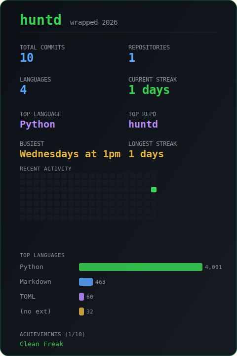
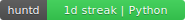

<div align="center">

# 🐺 huntd

**Your coding fingerprint — local git analytics dashboard for all your repos.**

[](https://pypi.org/project/huntd/)
[](https://pypi.org/project/huntd/)


</div>

---

Scan every git repo on your machine. Get streaks, heatmaps, language trends, project health scores, and more — all in one interactive terminal dashboard.

> WakaTime costs $9/mo. GitHub Wrapped is once a year. **huntd** is free, local, instant, and sees everything.

## Install

```bash
pip install huntd
```

## Quick Start

```bash
# Interactive TUI dashboard
huntd ~/code

# One-shot summary (no TUI)
huntd ~/code --summary

# JSON output (pipe to jq, scripts, etc.)
huntd ~/code --json

# Scan current directory
huntd
```

## Filtering

Slice your data by time, author, or compare directories.

```bash
# Only commits from 2025
huntd ~/code --summary --since 2025-01-01 --until 2025-12-31

# Only your commits in team repos
huntd ~/code --summary --author "Joe"

# Last 3 months
huntd ~/code --summary --since "3 months ago"

# Compare two directories side by side
huntd --compare ~/work ~/personal --summary

# Filters work with all modes
huntd ~/code --json --author "Joe" --since 2025-01-01
```

## Sharing & Export

```bash
# Spotify Wrapped-style SVG card
huntd ~/code --wrapped

# Clean markdown report (for Notion, blogs, performance reviews)
huntd ~/code --report

# SVG badge for GitHub profile READMEs
huntd ~/code --badge

# Combine with filters
huntd ~/code --wrapped --since 2025-01-01

# Generate all three at once
huntd ~/code --wrapped --report --badge
```

### Wrapped Card

<p align="center">
  
</p>

### Profile Badge

<p align="center">
  
</p>

## Live Mode

Keep the dashboard running and watch it update as you commit.

```bash
# Auto-refresh dashboard every 30 seconds
huntd ~/code --watch

# Custom interval (seconds)
huntd ~/code --watch --interval 60

# Toggle watch on/off inside the TUI with 'w'
# Press 'w' to start/stop live refresh anytime

# Install post-commit hooks across all repos
huntd ~/code --install-hook
```

## What You Get

```
  _                _      _
 | |__  _   _ _ __| |_ __| |
 | '_ \| | | | '_ \ __/ _` |
 | | | | |_| | | | | || (_| |
 |_| |_|\__,_|_| |_|\__\__,_|
  your coding fingerprint

╭────────────────────────────────── 🐺 huntd ──────────────────────────────────╮
│                                                                              │
│   14 repos    4,847 commits    8 languages                                   │
│   🔥 14 day streak    🏆 31 longest                                          │
│   📅 Tuesdays at 10pm    ⚡ 3.2/day                                          │
│   📊 ▁▃▅█▆▃▂  Mon→Sun                                                       │
│                                                                              │
╰──────────────────────────────────────────────────────────────────────────────╯

──────────────────────────── 📊 Contributions ─────────────────────────────────
 Mon ░░▒▓█▒░░▒▒▓▓█░░░▒▒▓█▒░░░░▒▒▓▓████▒▒░░░
 Tue ░▒▓█▒░░░▒▒▓▓█░░░▒▒▓▓█▒░░░░▒▓▓████▓▒░░░
 Wed ░▒▒▓░░░░▒▒▓█▒░░░▒▒▓▓░░░░░▒▒▓████▓▒░░░░
 Thu ░░▒▓█▒░▒▒▓▓█░░░▒▒▓█▒░░░░▒▒▓▓████▒▒░░░░
 Fri ░░▒▒░░░░▒▒▓░░░░░▒▒▓▒░░░░░▒▒▓███▓▒░░░░░
 Sat ░░░░░░░░░░░░░░░░░░░░░░░░░░▒▒▓▓▓▒░░░░░░
 Sun ░░░░░░░░░▒▒░░░░░░▒░░░░░░░░░▒▓▓▒░░░░░░░

──────────────────────────── 📦 Repositories ──────────────────────────────────
┏━━━━━━━━━━━━━━┳━━━━━━━━━┳━━━━━━━━━━━┳━━━━━━━━━━━━━━━┳━━━━━━━━━┳━━━━━━━━┓
┃ Repo         ┃ Commits ┃ Language  ┃        Health ┃  +Lines ┃ -Lines ┃
┡━━━━━━━━━━━━━━╇━━━━━━━━━╇━━━━━━━━━━━╇━━━━━━━━━━━━━━━╇━━━━━━━━━╇━━━━━━━━┩
│ cloud-dash   │     847 │ Python    │ █████████░ 95 │ +15,847 │ -1,204 │
│ pulse-mobile │     623 │ Go        │ ████████░░ 85 │  +8,619 │   -820 │
│ data-engine  │     412 │ Rust      │ ████████░░ 80 │  +6,074 │   -503 │
│ api-gateway  │     203 │ TypeScript│ ███████░░░ 70 │  +2,876 │   -118 │
└──────────────┴─────────┴───────────┴───────────────┴─────────┴────────┘

───────────────────────────── 🔤 Languages ────────────────────────────────────
┏━━━━━━━━━━━━┳━━━━━━━━━━━━━━━┳━━━━━━━━━━━━━━━━━━━━━━━━━━━┓
┃ Language   ┃ Lines Changed ┃                           ┃
┡━━━━━━━━━━━━╇━━━━━━━━━━━━━━━╇━━━━━━━━━━━━━━━━━━━━━━━━━━━┩
│ Python     │        15,823 │ ████████████████████  62% │
│ Go         │         5,628 │ ███████░░░░░░░░░░░░░  22% │
│ Rust       │         2,519 │ ███░░░░░░░░░░░░░░░░░   9% │
│ TypeScript │           827 │ █░░░░░░░░░░░░░░░░░░░   3% │
└────────────┴───────────────┴───────────────────────────┘

───────────────────────────── ⚡ Activity ─────────────────────────────────────
╭──────────────────────────────────────────────────────────────────────────────╮
│   📅 Busiest day:  Tuesday    ⏰ Busiest hour: 10pm    ⚡ Avg: 3.2/day      │
│   📊 Hourly: ▁▁▁▁▁▁▂▃▄▅▃▃▅▆▅▆▃▂▃▅▆█▇▂  0h→23h                            │
╰──────────────────────────────────────────────────────────────────────────────╯

──────────────────────────── 📈 Velocity ────────────────────────────────────
╭──────────────────────────────────────────────────────────────────────────────╮
│   ▂▃▅▃▄▆▅▇█▆▅▃  (↑ up)    Peak: 2025-W42 (27 commits)                     │
╰──────────────────────────────────────────────────────────────────────────────╯

────────────────────────── 📈 Language Evolution ────────────────────────────
┏━━━━━━━━━━━━┳━━━━━━━━━┳━━━━━━━━━┳━━━━━━━━━┳━━━━━━━━━┳━━━━━━━━━┳━━━━━━━━━┳━━━━━━━┓
┃ Language   ┃ 2025-01 ┃ 2025-02 ┃ 2025-03 ┃ 2025-04 ┃ 2025-05 ┃ 2025-06 ┃ Trend ┃
┡━━━━━━━━━━━━╇━━━━━━━━━╇━━━━━━━━━╇━━━━━━━━━╇━━━━━━━━━╇━━━━━━━━━╇━━━━━━━━━╇━━━━━━━┩
│ Python     │   2,410 │   1,850 │   3,200 │   2,900 │   4,100 │   3,800 │ ▂▁▄▃▆█│
│ Go         │     820 │     640 │     900 │   1,100 │     750 │     680 │ ▅▃▆█▄▃│
│ TypeScript │       - │     120 │     450 │     800 │   1,200 │   1,500 │ ▁▁▂▄▆█│
└────────────┴─────────┴─────────┴─────────┴─────────┴─────────┴─────────┴───────┘

─────────────────────────── 🎯 Focus Score ──────────────────────────────────
╭──────────────────────────────────────────────────────────────────────────────╮
│   Avg repos/day: 2.3  [balanced]                                            │
│   Most focused:  2025-04-12    Most scattered: 2025-06-01                   │
╰──────────────────────────────────────────────────────────────────────────────╯

────────────────────────── 📅 Weekday vs Weekend ────────────────────────────
╭──────────────────────────────────────────────────────────────────────────────╮
│   Weekday: 78.4% (3,802 commits, +42,190 lines)                            │
│   Weekend: 21.6% (1,045 commits, +11,830 lines)                            │
╰──────────────────────────────────────────────────────────────────────────────╯

──────────────────────────── 🔥 File Hotspots ───────────────────────────────
┏━━━━━━━━━━━━━━━━━━━━━━━━━━━━━━━━━━━┳━━━━━━━━━┳━━━━━━━━━┓
┃ File                              ┃   Churn ┃ Touches ┃
┡━━━━━━━━━━━━━━━━━━━━━━━━━━━━━━━━━━━╇━━━━━━━━━╇━━━━━━━━━┩
│ cloud-dash/src/dashboard.py       │   4,210 │      47 │
│ pulse-mobile/pkg/api/handler.go   │   2,830 │      31 │
│ data-engine/src/pipeline.rs       │   1,950 │      22 │
│ api-gateway/src/routes/index.ts   │   1,120 │      18 │
└───────────────────────────────────┴─────────┴─────────┘

──────────────── 🏆 Achievements (4/10) ─────────────────
╭──────────────────────────────────────────────────────────────────────────────╮
│   💯 Century  100-day coding streak                                         │
│   📝 Prolific  1,000+ total commits                                        │
│   🌍 Polyglot  5+ languages with 100+ lines each                           │
│   📦 Diversified  10+ active repos                                         │
│   🔒 Marathon  365-day coding streak                                        │
│   🔒 Night Owl  50%+ commits after midnight                                │
│   🔒 Early Bird  50%+ commits before 9am                                   │
│   🔒 Weekend Warrior  40%+ commits on weekends                             │
│   🔒 Monorepo Monster  Single repo with 500+ commits                       │
│   🔒 Clean Freak  All repos have health score 80+                          │
╰──────────────────────────────────────────────────────────────────────────────╯
```

## Features

| Feature | Description |
|---------|-------------|
| **Multi-repo scanning** | Recursively finds every git repo under a directory |
| **Coding streaks** | Current and longest streak computed from local commits |
| **Contribution heatmap** | GitHub-style green activity grid across all repos |
| **Language breakdown** | Lines changed per language with colored trend bars |
| **Project health scores** | 0-100 score with colored bars (green/yellow/red) |
| **Activity patterns** | Busiest day, busiest hour, sparklines, average commits per day |
| **Top repos ranking** | Sorted by commit count with language and health |
| **Interactive TUI** | Navigate panels with keyboard (Textual-powered) |
| **Summary mode** | `--summary` for a styled Rich-formatted printout |
| **JSON export** | `--json` for scripting, pipelines, and integrations |
| **Date filtering** | `--since` and `--until` to scope commits to a time window |
| **Author filtering** | `--author` to filter by committer name or email |
| **Compare mode** | `--compare` two directories side by side |
| **Code velocity** | Weekly commit trends with sparkline and up/down/stable indicator |
| **Language evolution** | Monthly language mix over time — see how your stack shifts |
| **Focus score** | Unique repos per day — deep focus vs scattered work patterns |
| **Weekday vs weekend** | Split activity by work days vs weekends with percentages |
| **File hotspots** | Most-churned files across all repos (find your messiest code) |
| **Achievements** | 10 unlockable badges — Century, Polyglot, Night Owl, and more |
| **Wrapped card** | `--wrapped` generates a Spotify Wrapped-style SVG card |
| **Markdown report** | `--report` exports a clean report for Notion, blogs, reviews |
| **Profile badge** | `--badge` generates an SVG badge for GitHub READMEs |
| **Live mode** | `--watch` auto-refreshes the dashboard as you commit |
| **Custom interval** | `--interval N` sets refresh frequency in seconds |
| **Git hooks** | `--install-hook` adds post-commit hooks to all scanned repos |

## How It Works

1. **Scan** — Recursively finds all `.git` directories under the target path
2. **Extract** — Runs optimized `git log` commands in parallel (8 threads) across all repos
3. **Analyze** — Computes streaks, heatmaps, language stats, health scores, and activity patterns
4. **Display** — Renders an interactive dashboard or summary

All data comes from local git history. No API keys. No accounts. No cloud. No cost.

## Output Modes

```bash
# Interactive dashboard (default)
huntd ~/code

# Static summary — great for screenshots
huntd ~/code --summary

# JSON — pipe to jq, save to file, feed to scripts
huntd ~/code --json
huntd ~/code --json | jq '.repos[] | select(.commits > 100)'

# Compare two directories
huntd --compare ~/work ~/personal --summary
huntd --compare ~/work ~/personal --json

# Version
huntd --version
```

## Health Score

Each repo gets a 0-100 health score based on:

| Factor | Points | Criteria |
|--------|--------|----------|
| Commit recency | 0-40 | Last commit within 7d (40), 30d (30), 90d (20), 1yr (10) |
| Total commits | 0-20 | 100+ (20), 50+ (15), 10+ (10), 1+ (5) |
| Has README | 0-15 | README file present in repo root |
| Branch hygiene | 0-15 | 1-5 branches (15), 6-10 (10), 11+ (5) |
| Clean tree | 0-10 | No uncommitted changes |

## Why Not X?

| Tool | Limitation |
|------|-----------|
| **WakaTime** | Cloud-only, $9/mo, tracks editor time not git history |
| **GitHub Wrapped** | Annual only, GitHub repos only, no local/private repos |
| **onefetch** | Single repo snapshot, not interactive |
| **git-quick-stats** | Single repo, text dump, no dashboard |
| **tokei / scc** | Line counting only, no history or trends |

**huntd** is the first tool to combine multi-repo scanning + streaks + heatmaps + language trends + health scores in one interactive dashboard. Free. Local. Instant.

## Development

```bash
git clone https://github.com/TRINITY-21/huntd.git
cd huntd
pip install -e ".[dev]"
python -m pytest tests/ -v
```

## Support

If this project is useful to you, consider supporting it.

<a href="https://buymeacoffee.com/trinity_21" target="_blank"></a>

## License

MIT
